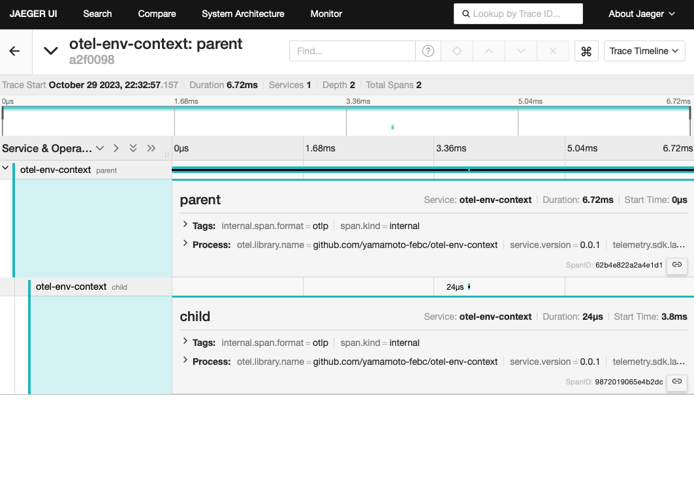

# otel-env-context

`exec.Command`などで外部コマンドを呼び出す際に環境変数を用いてW3C Trace Context形式でトレースコンテキストを伝搬させる例

## 実行方法

```bash
# jaegerを起動し、cmd/otel-parentを実行してトレースを送信する
docker compose up -d

# jaegerを開く
open http://localhost:16686/search
```



## ポイント

### 準備

まずPropagatorを以下のように登録しておきます。

```go
otel.SetTextMapPropagator(
	propagation.NewCompositeTextMapPropagator(
		propagation.TraceContext{},
		propagation.Baggage{},
	),
)
```

### 親コマンド側

親コマンド`otel-parent`において以下のようにトレースを開始します。  

```go
otel.Tracer(instrumentationName).Start(context.Background(), "parent")
```

`otel-parent`は子コマンド`otel-child`を呼び出します。  

この際、`otel-parent`のトレースコンテキストをW3C Trace Context形式で環境変数に指定することでコマンド`otel-child`を伝搬します。
W3C Trace Context形式への変換は`propagation.TraceContext`に任せます。

子コマンドへの環境変数の指定は以下のように行います。

```go
// Propagatorに指定されているpropagation.TraceContextを用いてトレースコンテキストをenvCarrierに書き出し
envCarrier := propagation.MapCarrier{}
otel.GetTextMapPropagator().Inject(ctx, envCarrier)

// 書き出したトレースコンテキストを環境変数に設定
for _, key := range envCarrier.Keys() {
	cmd.Env = append(cmd.Env, key+"="+envCarrier.Get(key))
}
```

### 子コマンド側

子コマンド`otel-child`側では環境変数からトレースコンテキストを取得します。

```go
envCarrier := propagation.MapCarrier{
    "traceparent": os.Getenv("traceparent"),
    "tracestate":  os.Getenv("tracestate"),
}
ctx, span := otel.Tracer(instrumentationName).Start(
    otel.GetTextMapPropagator().Extract(context.Background(), envCarrier),
    "child", 
)
```

## License

`otel-env-context` Copyright (C) 2023 Kazumichi Yamamoto

This project is published under [MIT](LICENSE).
  
